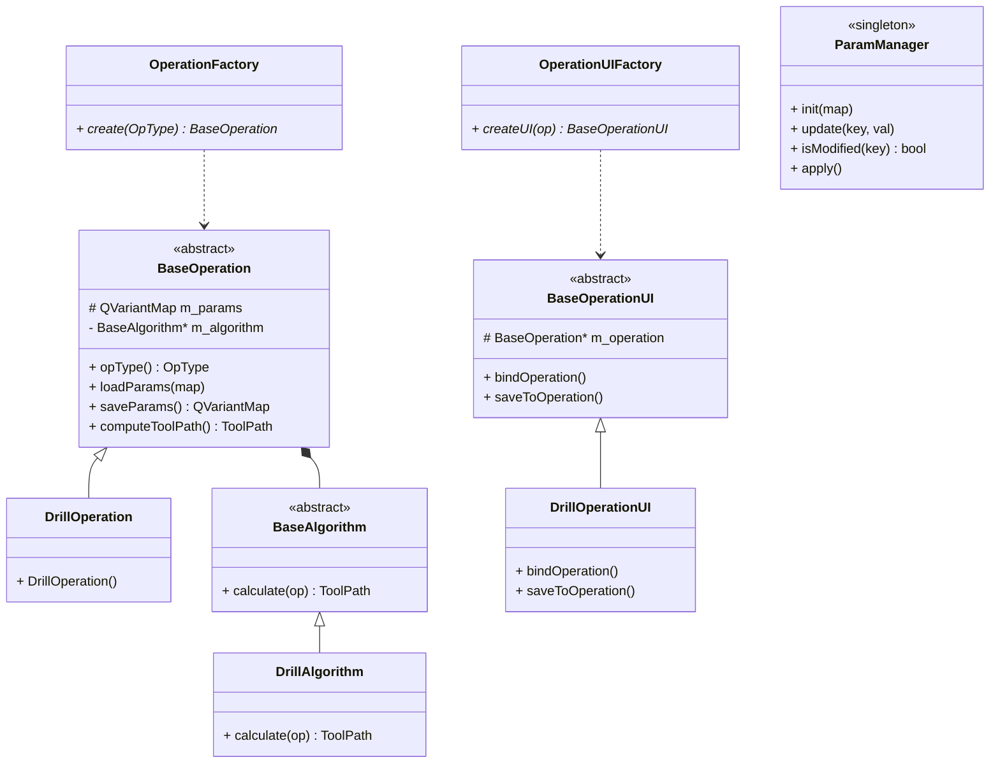

# CamCore
**Lightweight CAM Core Framework for CNC Programming**
轻量化数控加工CAM核心框架 | 工业软件标准架构

## 开发环境
- **IDE**: Qt Creator 14.0.1
- **Qt Version**: Qt 6.5 LTS
- **Build System**: CMake
- **Language**: C++17

---

# 架构总览
CamCore 是一套**工序 - 算法 - UI 一一对应**的 CAM 工业软件架构。
- 工序 = 数据
- 算法 = 刀路计算
- UI = 参数面板
- 工厂自动创建与绑定

---

# 目录结构
```
CamCore/
├── CMakeLists.txt   # CMake 构建文件
├── main.cpp
├── core/            # 工序基类 + 工厂 + 全局定义
├── algorithm/       # 刀路算法
├── ui/              # UI基类 + 工序UI
└── template/        # 参数管理 + 模板系统
```

---

# 核心类说明

## 1. Core 层（工序核心）
### `BaseOperation`
- **抽象工序基类**
- 统一接口：加载/保存参数、计算刀路
- **组合持有刀路算法**

### `DrillOperation`
- 钻孔工序（继承 BaseOperation）
- 构造时自动绑定 `DrillAlgorithm`

### `OperationFactory`
- 工厂模式：根据类型创建工序

---

## 2. Algorithm 层（刀路算法）
### `BaseAlgorithm`
- 算法抽象基类
- 纯虚接口 `calculate(op)`

### `DrillAlgorithm`
- 钻孔刀路实现

---

## 3. UI 层（参数面板）
### `BaseOperationUI`
- UI 抽象基类
- 接口：`bindOperation()` / `saveToOperation()`

### `DrillOperationUI`
- 钻孔参数面板
- 自动绑定钻孔工序
- 参数修改高亮

### `OperationUIFactory`
- 根据工序自动创建对应 UI

---

## 4. Template 层（模板与参数）
### `ParamManager`
- 单例参数管理器
- 检测修改、状态标记、应用/撤销

### `TemplateManager`
- 工艺模板管理器
- 支持工序快照、复用

---

# UML 类图（Mermaid）


---

# 快速运行（Qt 6.5 + Qt Creator 14.0.1）
1. 打开 Qt Creator 14.0.1
2. 打开 `CMakeLists.txt`
3. 构建套件选择 **Qt 6.5**
4. 编译 → 运行
5. 自动打开钻孔工序UI，可编辑参数、计算刀路、保存模板
